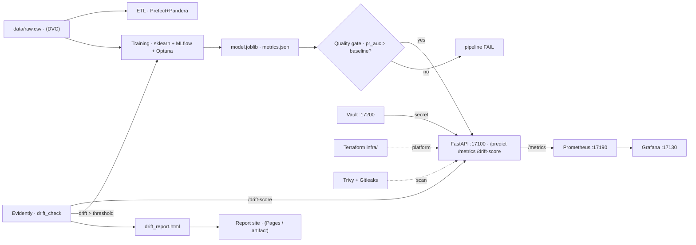

# MLOps Churn Demo

[](https://github.com/jzubielik/mlops-churn-demo/actions/workflows/ci.yml)
[](https://github.com/jzubielik/mlops-churn-demo/actions/workflows/security.yml)
[](https://github.com/jzubielik/mlops-churn-demo/actions/workflows/pages.yml)
[](LICENSE)

An end-to-end **MLOps** demo on a real business problem: **customer churn
prediction** for a telecom operator. A full, production-grade ML
workflow — from versioned data, through tracked training, a quality gate, serving,
drift monitoring, to automatic retraining — entirely **runnable locally**
and verified on a **free GitHub Actions runner** (no data downloads:
the dataset is synthesized deterministically).

## Problem

Churn = a customer leaving the service. Task: **binary classification** —
predict which customers will leave, so you can act in time (retention). The data is
**imbalanced** (~26% churn), so we measure quality with **PR-AUC / F1**, not accuracy.
Dataset: **Telco Customer Churn** (~7k customers, ~20 features).

## Architecture



Full diagram and description: [`docs/architecture.md`](docs/architecture.md).

## Quick start

```bash
make install   # .venv + dependencies (+ MLflow patch for Python 3.14)
make demo      # the WHOLE end-to-end flow (data→ETL→training→gate→serve smoke→drift)
```

`make demo` is the fastest way to see the entire workflow go green (the Docker-free
path). The other targets run individual phases separately (`make help`).

## Components by MLOps lifecycle

| MLOps phase | What it does | Make targets | Files |
|---|---|---|---|
| **Data + versioning** | Telco churn synthesis, DVC | `data` `repro` `metrics` | `scripts/make_data.py`, `dvc.yaml` |
| **Data validation** | Prefect ETL + Pandera contract (fail-fast) | `etl` `etl-bad` | `pipelines/` |
| **Training + experiments** | sklearn Pipeline, MLflow, Optuna, promotion | `train` `tune` `promote` `mlflow-ui` | `src/churnml/`, `experiments/` |
| **Quality gate** | gating by PR-AUC vs baseline | `gate` `ci` | `scripts/gate.py`, `baseline.txt` |
| **CI/CD** | lint→test→train→gate→build | (GitHub Actions) | `.github/workflows/ci.yml` |
| **Serving** | FastAPI + Docker (multi-stage) | `serve` `predict` `loadtest` `docker-build` | `serving/` |
| **Monitoring** | Prometheus + Grafana (QPS, p99, drift) | `monitor-up` `monitor-down` | `monitoring/` |
| **Drift + retraining** | Evidently, gauge, retraining trigger | `gen-drift` `drift` | `monitoring/drift_check.py`, `scripts/make_drifted.py` |
| **Infrastructure (IaC)** | Terraform: bucket, registry, env-config | `infra-init` `infra-plan` `infra-apply` `infra-destroy` | `infra/` |
| **Security** | Vault (startup secret) + Trivy + Gitleaks | `vault-up` `vault-seed` `vault-down` `scan` `gitleaks` | `security/`, `serving/vault.py`, `.github/workflows/security.yml` |
| **Reports / Pages** | static site with metrics + drift + cards | `site` | `scripts/build_site.py`, `.github/workflows/pages.yml` |
| **Automation** | on-demand drift + retraining (manual) | (GitHub Actions) | `.github/workflows/retrain.yml` |

> **Why no cron?** This is a demo repo with **synthetic, static data**, so scheduled
> runs (retrain / weekly security re-scan) would only burn free runner minutes without
> real signal — and create weekly issue noise. These workflows run **manually**
> (`retrain`) or **on code changes** (`security`: push/PR) on purpose. In a real system,
> where production data drifts over time, they would run on a `schedule:` cron. See the
> rationale in the headers of `.github/workflows/retrain.yml` and `security.yml`.

## Ports (host)

Service **17100** · Prometheus **17190** · Grafana **17130** · Vault **17200** · MLflow UI **17150**

## Run individual phases

```bash
# Data + reproducible pipeline (DVC)
make init && make data && make repro && make metrics

# ETL (Prefect) + data contract (Pandera)
make etl          # extract -> validate -> features -> load (parquet)
make etl-bad      # dirty data stopped by validation (exit 1)

# Experiments (MLflow) + quality gate
make train && make promote && make ci

# Serving (FastAPI :17100)
make train-model && make serve   # /health /predict /metrics /drift-score /docs

# Monitoring + drift
make monitor-up                  # Prometheus :17190 + Grafana :17130
make gen-drift && make drift     # drift report + (optional) retraining

# Infrastructure (Terraform, local)
make infra-init && make infra-apply && make infra-output && make infra-destroy

# Security
make vault-up && make vault-seed && make vault-status && make vault-down
make scan        # Trivy (HIGH/CRITICAL = fail)    make gitleaks  # secret scan

# Report site — GitHub Pages
make site        # site/index.html (metrics + drift_report.html + cards)
```

## Documentation

- [`docs/model_card.md`](docs/model_card.md) — model card (PR-AUC, limitations, fairness).
- [`docs/data_card.md`](docs/data_card.md) — data card (schema, validation, drift).
- [`docs/architecture.md`](docs/architecture.md) — full architecture + Mermaid diagram.
- [`PLAN.md`](PLAN.md) — milestone build plan.

## Stack

scikit-learn · DVC · MLflow · Prefect · Pandera · FastAPI · Prometheus + Grafana ·
Evidently · Docker · Terraform · Vault · Trivy/Gitleaks · GitHub Actions

## License

MIT — see [LICENSE](LICENSE).
