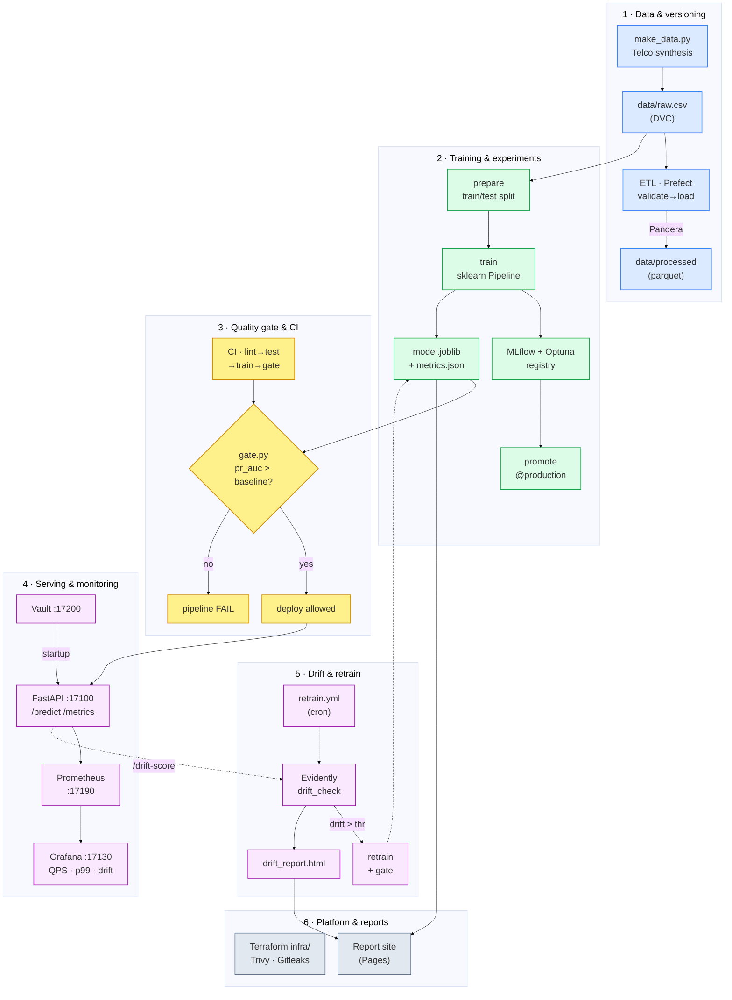

# Architecture — MLOps Churn Demo

A full, production-grade ML workflow for churn prediction, runnable locally and on
the free GitHub Actions runner. Each stage maps to an element of the MLOps
lifecycle.

## Flow diagram

## Mapping to the MLOps lifecycle

| Phase | Component | Files |
|---|---|---|
| Data / versioning | DVC + synthesis | `scripts/make_data.py`, `dvc.yaml`, `data/raw.csv.dvc` |
| Data validation | Prefect + Pandera | `pipelines/etl_flow.py`, `pipelines/schema.py` |
| Training / experiments | sklearn + MLflow + Optuna | `src/churnml/`, `experiments/` |
| Quality gate | metric gate (PR-AUC) | `scripts/gate.py`, `baseline.txt` |
| CI/CD | GitHub Actions | `.github/workflows/ci.yml` |
| Serving | FastAPI + Docker | `serving/app.py`, `serving/Dockerfile` |
| Monitoring | Prometheus + Grafana | `monitoring/` |
| Drift / retraining | Evidently | `monitoring/drift_check.py`, `scripts/make_drifted.py` |
| Infrastructure (IaC) | Terraform | `infra/` |
| Security | Vault + Trivy + Gitleaks | `security/`, `serving/vault.py`, `.github/workflows/security.yml` |
| Reports / Pages | static site | `scripts/build_site.py`, `.github/workflows/pages.yml` |
| Automation | scheduled retrain | `.github/workflows/retrain.yml` |

## Ports (host)
- Service: **17100** · Prometheus: **17190** · Grafana: **17130** · Vault: **17200** · MLflow UI: **17150**
